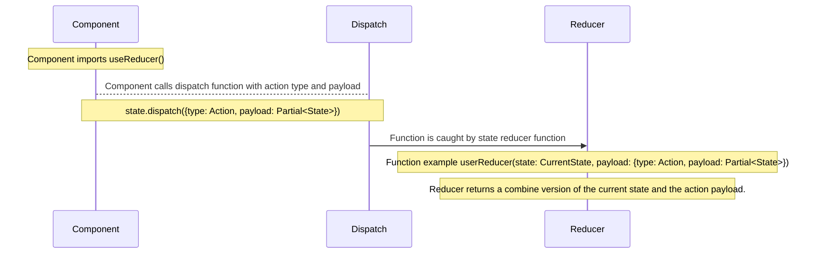

# Mermaid Sequence Diagram

```mermaid
sequenceDiagram
    participant C as Component
    participant D as Dispatch
    participant R as Reducer
    Note over C: Component imports useReducer()
    C-->D: Component calls dispatch function with action type and payload
    Note over C,D: state.dispatch({type: Action, payload: Partial<State>})
    D->>R: Function is caught by state reducer function
    Note over R: Function example userReducer(state: CurrentState, payload: {type: Action, payload: Partial<State>})  
    Note over R: Reducer returns a combine version of the current state and the action payload.
```